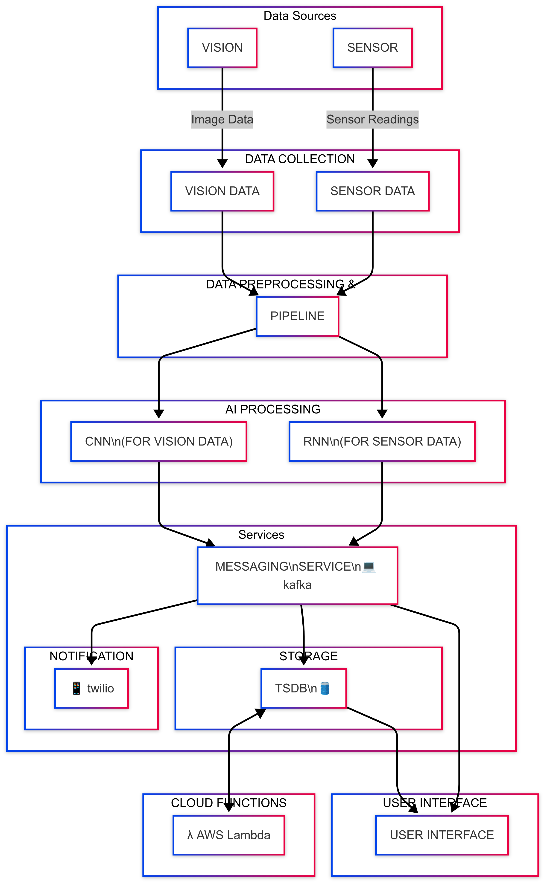

# Block Diagram

A block diagram is a graphical representation of a system, project, or scenario. It provides a functional view of a system and illustrates how the different elements of that system interlink.

## Architecture Overview

## Components

### 1. Data Sources
- **Vision**: Cameras or imaging systems providing image data
- **Sensor**: IoT devices or environmental sensors providing measurements

### 2. Data Collection Layer
- Collects raw data from both vision and sensor sources
- Maintains separate channels for different data types

### 3. Preprocessing Pipeline
- Cleans and prepares raw data
- Handles data formatting and normalization
- Ensures data quality before AI processing

### 4. AI Processing
- **CNN**: Computer vision model for image analysis
- **RNN**: Sequential model for time-series sensor data analysis

### 5. Services
- **Kafka**: Message broker for event streaming
- **Twilio**: Notification service for alerts
- **TSDB**: Time-series database for storage
- **AWS Lambda**: Serverless functions
- **User Interface**: Web/mobile interface for system interaction

## Data Flow
1. Data is captured from vision and sensor sources
2. Raw data is collected and preprocessed
3. AI models process the cleaned data
4. Results are published to Kafka
5. Kafka distributes to downstream services:
   - Notifications via Twilio
   - Storage in TSDB
   - Further processing via Lambda
   - Visualization in UI

