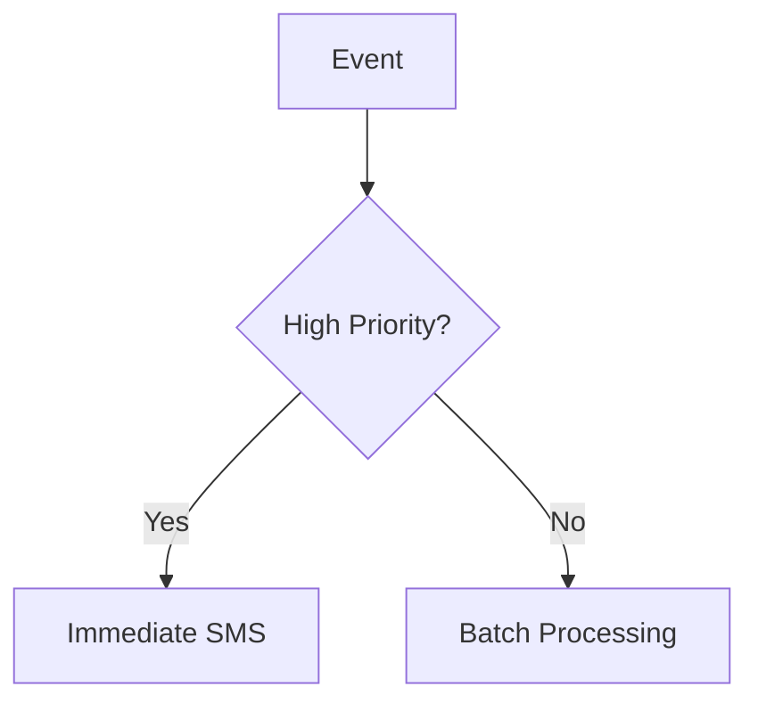
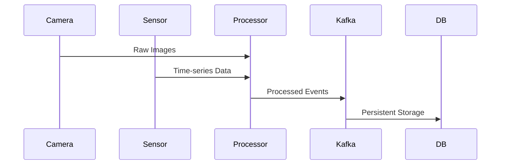

# Process Flow 


## Overview
This document describes the end-to-end process flow for our industrial monitoring system that combines vision data and sensor readings to detect anomalies and trigger appropriate actions.

## Process Flow Stages

### 1. Data Ingestion
**Input Sources**:
- **Vision Data**: 
  - Raw images from production line cameras
  - Frame rate: 5-30 FPS (configurable)
- **Sensor Data**:
  - Time-series readings from IoT devices
  - Metrics: Temperature, vibration, pressure, etc.

**Validation**:
```python
def validate_reading(reading):
    return (reading.timestamp is not None and 
            reading.value is not None and
            MIN_RANGE <= reading.value <= MAX_RANGE)

```

## 2. Data Normalization

### Vision Processing:
- Image enhancement
- Region of Interest (ROI) extraction
- Feature extraction (edges, textures, defects)

### Sensor Processing:
- Outlier removal
- Time alignment
- Unit standardization

## 3. Analysis Phase

### Vision Analysis:
- CNN-based defect detection
- Output: Defect classification with confidence scores

### Sensor Analysis:
- LSTM-based anomaly detection
- Output: Equipment health scores

## 4. Anomaly Detection

### Severity Classification:
| Severity Level | Criteria | Response Time |
|---------------|---------|--------------|
| Low | Confidence < 70% | 24 hours |
| Medium | 70% ≤ Confidence < 90% | 4 hours |
| High | Confidence ≥ 90% | Immediate |

## 5. Event Processing

### Kafka Topics:
- `critical-events` (High priority)
- `standard-events` (Medium priority)
- `informational-events` (Low priority)

### Alert Routing:


## 6. Data Persistence

### Storage Destinations:

#### Time-Series Database:
- Stores all sensor metrics
- Retention: 1 year

#### Object Storage:
- Annotated images
- System logs

## 7. User Interaction

### Dashboard Components:
- Real-time monitoring view
- Historical trend analysis
- Alert management console

### Automated Actions:
- Machine speed adjustment
- Production line pause
- Maintenance ticket creation

## Key Integration Points

### Data Flow:


## System Components

| Component | Technology | Purpose |
|-----------|------------|---------|
| Vision Processing | OpenCV + PyTorch | Defect detection |
| Sensor Analysis | TensorFlow LSTM | Anomaly detection |
| Message Bus | Apache Kafka | Event streaming |
| Storage | TimescaleDB + S3 | Data persistence |
